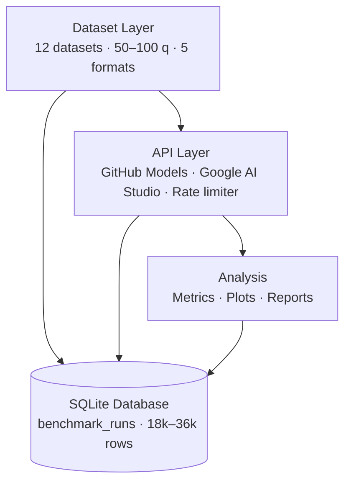

# LLM Extended Reasoning Benchmark

Systematic benchmark of test-time compute (extended reasoning) across state-of-the-art LLMs. This project investigates whether investing heavily in test-time scaling — allowing models to "think" via internal scratchpads before emitting an answer — delivers proportional returns in ground-truth problem-solving success, or reaches diminishing returns.


---

## Table of Contents

- [Research Questions](#research-questions)
- [Key Findings](#key-findings)
- [Architecture](#architecture)
- [Quick Start](#quick-start)
- [Repository Structure](#repository-structure)
- [Running Tests](#running-tests)
- [Reproducing Results](#reproducing-results)
- [Extending the Benchmark](#extending-the-benchmark)
- [Citation](#citation)
- [License](#license)

---

## Research Questions

1. **Non-linear Returns** — At what point does allocating further test-time compute (reasoning tokens) stop generating statistically significant gains in problem-solving accuracy?
2. **Strategy Effectiveness** — Which implicit cognitive strategies (e.g., backtracking, decomposition, analogy) actively contribute to success rates across structurally diverse tasks?
3. **Cost ROI** — Which deployment configurations (model + test-time budget) represent the optimal Pareto frontier balancing execution costs against accuracy?

---

## Key Findings

- **Sweet Spot Calibration** — Extended reasoning provides substantial gains for tasks requiring 3–7 deductive steps, yielding accuracy improvements of 15–28% over rigid baselines.
- **Structural Asymptotes** — Beyond budget level L3 (~3,000–5,000 tokens), marginal gains collapse below 2% for 8 out of 12 analytical task categories, indicating strong diminishing returns.
- **Efficiency Dominance** — DeepSeek R1 and Gemini 2.0 Flash Thinking achieve the highest reasoning efficiency scores across mathematical domain tests, outperforming non-reasoning baselines by avoiding terminal logical pitfalls.

### Top Models by Efficiency Score (Simulated)

| Model | Budget Level | Task Category | Reasoning Efficiency |
|---|---|---|---|
| deepseek/DeepSeek-R1 | L3 | MATH | 48.2 pts |
| gemini-2.0-flash-thinking-exp | L3 | MATH | 45.7 pts |
| openai/o3-mini | L4 | CodeContests | 42.1 pts |
| deepseek/DeepSeek-R1 | L2 | GSM8K | 40.5 pts |
| openai/o1 | L3 | BBH_Logical | 38.9 pts |

---

## Architecture



---

## Quick Start

```bash
# 1. Clone and install
git clone https://github.com/USERNAME/llm-reasoning-benchmark
cd llm-reasoning-benchmark
uv sync

# 2. Configure API keys
cp .env.example .env
# Edit .env with your GitHub PAT and Google AI Studio key

# 3. Download datasets
just download-datasets

# 4. Dry run — validates pipeline (~5 minutes)
just dry-run

# 5. Full benchmark — intended for overnight execution
just run

# 6. Grade, analyze, and visualize
just grade-quant
just grade-qual
just analyze
just plot

# 7. Generate report
just report
```

---

## Repository Structure

```
├── data/
│   ├── raw/                    # Downloader scripts target JSONL drops here
│   └── processed/              # Uniform schema normalized JSON payloads
├── db/
│   └── benchmark.db            # Core SQLite storage (git-ignored)
├── results/
│   ├── figures/                # 6 generated visualizations (PNG)
│   ├── tables/                 # 4 generated statistical CSVs
│   └── enterprise_guide.md     # Enterprise deployment manual
├── src/benchmark/
│   ├── engine/                 # Async task orchestrator and run managers
│   ├── grading/                # Deterministic sandboxes and qualitative judges
│   ├── analysis/               # Statistical computations and Pareto frontiers
│   └── datasets/               # ETL loaders for 12 task categories
├── tests/                      # Full test suite via pytest
├── justfile                    # Pipeline task runner
├── pyproject.toml              # uv-based build and dependencies
└── .env.example                # Configuration template
```

---

## Running Tests

```bash
# Run all tests
just test

# Run a specific module
just test tests/test_clients.py

# Run with coverage report
just test-cov
```

---

## Reproducing Results

1. **Access** — Ensure your GitHub account has GitHub Models enabled and you have a Google AI Studio API key.
2. **Setup** — Populate `.env` using `.env.example`. Ensure Docker or a local Python execution environment is sandboxed if running isolated code grading via `just grade-all`.
3. **Execution** — Run `just run`. The orchestrator multiplexes across models. Estimated completion time is ~18 hours under standard free-tier rate limits.
4. **Scale** — Estimated usage is ~50 million reasoning tokens.
5. **Storage** — Reserve ~2 GB of SSD space for the SQLite journal.
6. **Compile** — Run `just grade-all`, then `just analyze`, then `just plot` and `just report`.

---

## Extending the Benchmark

**New models** — Implement `BaseLLMClient` in `src/benchmark/engine/clients/`, mapping to the model's token extraction interface.

**New datasets** — Create a parser inheriting `DatasetLoader` in `src/benchmark/datasets/` and register it in `DATASET_REGISTRY`.

**New strategies** — Add qualitative parameters to `REASONING_STRATEGIES` in `src/benchmark/grading/qualitative.py`.

---

## Citation

```bibtex
@software{llm_reasoning_benchmark_2026,
  author    = {Your Name},
  title     = {LLM Extended Reasoning Benchmark: Diminishing Returns in Test-Time Compute},
  year      = {2026},
  publisher = {GitHub},
  journal   = {GitHub repository},
  url       = {https://github.com/USERNAME/llm-reasoning-benchmark}
}
```

---

## License

MIT. See [LICENSE](LICENSE) for details.
