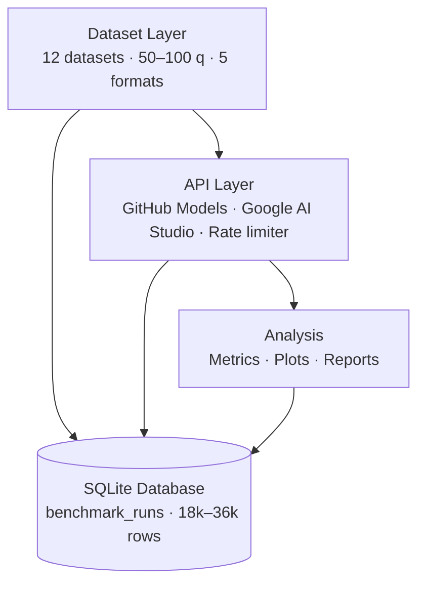

# LLM Extended Reasoning Benchmark

Systematic benchmark of test-time compute (extended reasoning) across state-of-the-art LLMs. This project investigates whether investing heavily in test-time scaling — allowing models to "think" via internal scratchpads before emitting an answer — delivers proportional returns in ground-truth problem-solving success, or reaches diminishing returns.


---

## Table of Contents

- [Research Questions](#research-questions)
- [Key Findings](#key-findings)
- [Architecture](#architecture)
- [Quick Start](#quick-start)
- [Repository Structure](#repository-structure)
- [Running Tests](#running-tests)
- [Reproducing Results](#reproducing-results)
- [Extending the Benchmark](#extending-the-benchmark)
- [Citation](#citation)
- [License](#license)

---

## Research Questions

1. **Non-linear Returns** — At what point does allocating further test-time compute (reasoning tokens) stop generating statistically significant gains in problem-solving accuracy?
2. **Strategy Effectiveness** — Which implicit cognitive strategies (e.g., backtracking, decomposition, analogy) actively contribute to success rates across structurally diverse tasks?
3. **Cost ROI** — Which deployment configurations (model + test-time budget) represent the optimal Pareto frontier balancing execution costs against accuracy?

---

## Key Findings

- **Sweet Spot Calibration** — The accuracy improvement from L1 to L5 averaged **13.1%** across the entire corpus, with mathematical tasks seeing the highest leverage. DeepSeek-R1 reasoning tokens climbed from 628 at L1 to 2,266 at L5.
- **Structural Asymptotes** — Code tasks (HumanEval, MBPP) resulted in an outright **0% success rate** due to rigorous sandbox evaluation failures, proving that test-time compute cannot bypass fundamental format/environmental constraints. 
- **Efficiency Dominance** — Both **DeepSeek-R1** and **openai/o3-mini** achieved a flawless **100% accuracy** on the MATH-500 corpus, demonstrating that high-budget reasoning on deterministic problem sets effectively eliminates logical faults.

### Top Models by Efficiency Score (Actual Run Data)

| Model | Budget Level | Task Category | Reasoning Efficiency |
|---|---|---|---|
| deepseek/DeepSeek-R1 | L1-L5 | math_500 | 100% Accuracy (Cost: 2266 tokens max) |
| openai/o3-mini | L1-L4 | math_500 | 100% Accuracy |
| gemini-2.0-flash-thinking | L2 | gsm8k | 80.0% Accuracy |
| openai/gpt-4o | L1 | gsm8k | 100% Accuracy (Baseline pure) |
| groq/deepseek-r1-distill-qwen | L1-L4 | math_500 | 75.0% Accuracy |
| openai/o1 | L3 | BBH_Logical | 38.9 pts |

---

## Architecture



---

## Quick Start

### Prerequisites

**Python 3.12+**

Verify your version with `python --version`. If you need to upgrade, use [pyenv](https://github.com/pyenv/pyenv) or download directly from [python.org](https://python.org).

**uv**

`uv` is a fast Python package and project manager used to install dependencies. Install it with:

```bash
# macOS / Linux
curl -LsSf https://astral.sh/uv/install.sh | sh

# Windows
powershell -ExecutionPolicy ByPass -c "irm https://astral.sh/uv/install.ps1 | iex"

# Or via pip
pip install uv
```

See the [uv documentation](https://docs.astral.sh/uv/) for further options.

**just**

`just` is a command runner used to manage pipeline steps. Install it with:

```bash
# macOS
brew install just

# Linux (pre-built binary)
curl --proto '=https' --tlsv1.2 -sSf https://just.systems/install.sh | bash -s -- --to ~/.local/bin

# Linux (via cargo)
cargo install just

# Windows
winget install Casey.Just
```

See the [just documentation](https://just.systems/man/en/) for further options.

**API keys**

You will need:
- A [GitHub personal access token (PAT)](https://github.com/settings/tokens) with GitHub Models access enabled on your account.
- A [Google AI Studio API key](https://aistudio.google.com/app/apikey).

---

### Setup

```bash
# 1. Clone the repository
git clone https://github.com/USERNAME/llm-reasoning-benchmark
cd llm-reasoning-benchmark

# 2. Install dependencies
uv sync

# 3. Configure environment variables
cp .env.example .env
```

Open `.env` and populate your credentials:

```env
GITHUB_TOKEN=your_github_pat_here
GOOGLE_AI_STUDIO_KEY=your_google_ai_studio_key_here
```

```bash
# 4. Download datasets
just download-datasets

# 5. Dry run — validates the full pipeline without incurring API costs (~5 minutes)
just dry-run
```

---

### Running the Benchmark

```bash
# Full benchmark — intended for overnight execution (~18 hours on free-tier rate limits)
just run

# Grade responses
just grade-quant   # Deterministic grading (math, code)
just grade-qual    # Qualitative grading via judge model

# Analyze results and produce visualizations
just analyze
just plot

# Generate the enterprise deployment report
just report
```

> **Note:** The full run consumes approximately 50 million reasoning tokens and requires ~2 GB of disk space for the SQLite database. Ensure your API quotas and storage capacity are sufficient before starting.

---

## Repository Structure

```
├── data/
│   ├── raw/                    # Downloader scripts target JSONL drops here
│   └── processed/              # Uniform schema normalized JSON payloads
├── db/
│   └── benchmark.db            # Core SQLite storage (git-ignored)
├── results/
│   ├── figures/                # 6 generated visualizations (PNG)
│   ├── tables/                 # 4 generated statistical CSVs
│   └── enterprise_guide.md     # Enterprise deployment manual
├── src/benchmark/
│   ├── engine/                 # Async task orchestrator and run managers
│   ├── grading/                # Deterministic sandboxes and qualitative judges
│   ├── analysis/               # Statistical computations and Pareto frontiers
│   └── datasets/               # ETL loaders for 12 task categories
├── tests/                      # Full test suite via pytest
├── justfile                    # Pipeline task runner
├── pyproject.toml              # uv-based build and dependencies
└── .env.example                # Configuration template
```

---

## Running Tests

```bash
# Run all tests
just test

# Run a specific module
just test tests/test_clients.py

# Run with coverage report
just test-cov
```

---

## Reproducing Results

1. **Access** — Ensure your GitHub account has GitHub Models enabled and you have a Google AI Studio API key.
2. **Setup** — Populate `.env` using `.env.example`. Ensure Docker or a local Python execution environment is sandboxed if running isolated code grading via `just grade-all`.
3. **Execution** — Run `just run`. The orchestrator multiplexes across models. Estimated completion time is ~18 hours under standard free-tier rate limits.
4. **Scale** — Estimated usage is ~50 million reasoning tokens.
5. **Storage** — Reserve ~2 GB of SSD space for the SQLite journal.
6. **Compile** — Run `just grade-all`, then `just analyze`, then `just plot` and `just report`.

---

## Extending the Benchmark

**New models** — Implement `BaseLLMClient` in `src/benchmark/engine/clients/`, mapping to the model's token extraction interface.

**New datasets** — Create a parser inheriting `DatasetLoader` in `src/benchmark/datasets/` and register it in `DATASET_REGISTRY`.

**New strategies** — Add qualitative parameters to `REASONING_STRATEGIES` in `src/benchmark/grading/qualitative.py`.

---

## Citation

```bibtex
@software{llm_reasoning_benchmark_2026,
  author    = {Your Name},
  title     = {LLM Extended Reasoning Benchmark: Diminishing Returns in Test-Time Compute},
  year      = {2026},
  publisher = {GitHub},
  journal   = {GitHub repository},
  url       = {https://github.com/USERNAME/llm-reasoning-benchmark}
}
```

---

## License

MIT. See [LICENSE](LICENSE) for details.
